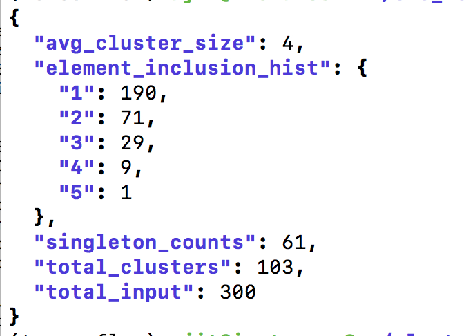

# Sentence representation using [CLS] vectors and vector clustering

Sentence representation using the [CLS] vector of a pre-trained model without fine-tuning. 

This repository also contains code for clustering vectors. Input to clustering is two files - vector file (text file) and corresponding descriptor file naming the vectors. Additional paramters are zscore and max tail pick to control how much to pick from distribution tails

# Installation

Setup pytorch environment with/without GPU support using link https://github.com/ajitrajasekharan/multi_gpu_test

pip install gdown

./fetch_model.sh

# Usage

*phase1.sh test.txt output.txt*

This will output the neighbors for each sentence in test.txt  
Example below

* Output files for phase1
  * **sent_vectors.npy** [CLS] vectors for each input sentence
  * **user specified output file** contains the neighborhood of each input sentence *(example shown  above)*

________________________________________________________________________________________________

*phase2.sh*

This script essentially invokes 

*python sentence_dist.py -terms $input -vectors sent_vectors.npy -zscore 4*

this scitpt can be used to either examine the sentence vectors *(option 0)* or create clusters *(option 1)*. The stats of the clusters are also output

* Output files for option 0
  * **cum_dist.txt** Cumulative histogram of distribution
  * **zero_vec_counts.txt** orthogonal vector count
  * **tail_counts.txt** tail count of vectors

* Output files for option 1
  * **sent_cluster_pivots.txt** Sentence clusters (just indices of sentences)
  * **pivots.json** Pivots of clusters
  * **inv_pivots.json** Inverted pivots
  * **cluster_stats.json**  cluster stats
  * **desc_clusters.txt** descriptive clusters (shows sentences for each cluster element)

# Note. 
Phase1 CLS vector generation requires a code patch to transformer file modeling_bert.py in order to work. This is to harvest [CLS] from head where this is a transform *(the bias value is not used)*.

# Misc experiments

* *graph_test.py* Confirm the predictions of model can be recapitulated using the MLM head's transform and bias. This is just to illustrate harvesting any vector from the top layer without including the head transform is not the same. This is particularly relevant when harvesting [CLS] vector from the topmost layer as opposed to from the head (which includes an additional transform).
*  *extract_head_bias.py* MLM head bias carries information analogous to a tfidf score for the vocab terms. This utility extracts bias from a model. This could have been done  by examine_model.py too.
* *mag_test.py* This examines to see if vector magnitudes carry any information. They dont seem to be unlike the bias values in the head which do carry information - a tfidf of sorts for the vocab terms
* *att_mask.py* this examines if the the attention weights of terms in a sentence has a pattern in its dependency on other terms. This examines it for all layers.
* *single_aminoseq_compare.py* This is used to create representations for amino acid sequences.  Use phase1.sh with compare option skipped. Then use this to compare amnino acid sequences with [CLS] vector.  Example invocation *python single_aminoseq_compare.py -input ribosomal.txt -ref_input run1/ref_seqs.txt -ref_vecs run1/sent_vectors.txt -output final.txt -ngram 4*

# License
MIT License
