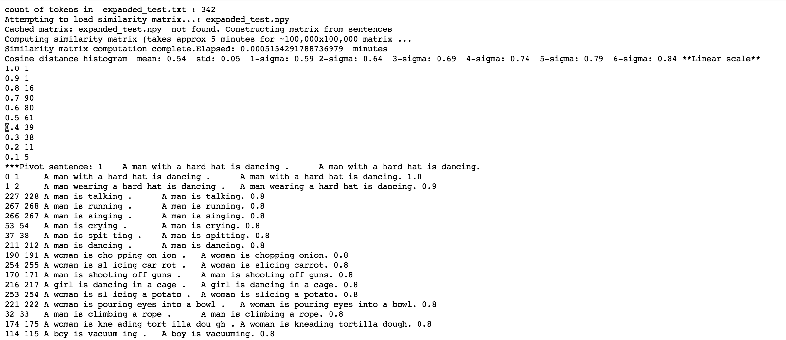

# Sentence representation using [CLS] vectors and vector clustering

Sentence representation using the [CLS] vector of a pre-trained model without fine-tuning. 

This repository also contains code for clustering vectors. Input to clustering is two files - vector file (text file) and corresponding descriptor file naming the vectors. Additional paramters are zscore and max tail pick to control how much to pick from distribution tails

# Installation

Setup pytorch environment with/without GPU support using link https://github.com/ajitrajasekharan/multi_gpu_test

pip install gdown

./fetch_model.sh

# Usage

*phase1.sh test.txt output.txt*

This will output the neighbors for each sentence in test.txt
Example below

________________________________________________________________________________________________

*phase2.sh*
this can be used to either examine the sentence vectors *(option 0)* or create clusters *(option 1)*. The stats of the clusters are also output

* Output files for option 0
  * **cum_dist.txt** Cumulative histogram of distribution
  * **zero_vec_counts.txt** orthogonal vector count
  * **tail_counts.txt** tail count of vectors

* Output files for option 1
  * **sent_cluster_pivots.txt** Sentence clusters
  * **pivots.json** Pivots of clusters
  * **inv_pivots.json** Inverted pivots
  * **cluster_stats.json**  cluster stats

# Note. 
This may require a code patch to transformer file modeling_bert.py in order to work

# License
MIT License
